<div align="center">
  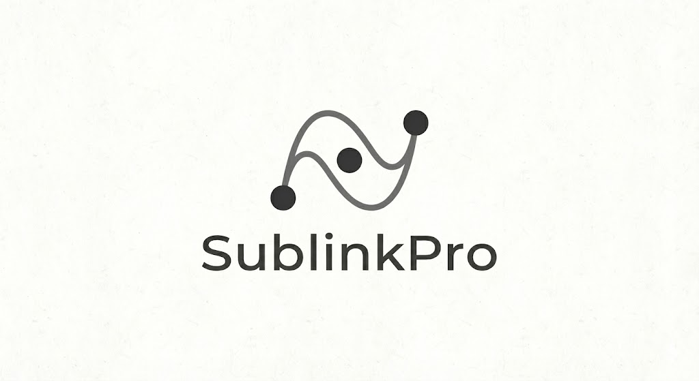
  
  **✨ 强大的代理订阅管理与转换工具 ✨**

  <p>
    
    
    
    
  </p>
  <p>
    
    
  </p>
  <p>
    
    
    
  </p>
  <p>
    
    
    
    
  </p>
  <p>
    <a href="https://github.com/ZeroDeng01/sublinkPro/issues">
      
    </a>
    <a href="https://github.com/ZeroDeng01/sublinkPro/releases">
      
    </a>
  </p>
</div>

---

## 📖 项目简介

`SublinkPro` 是基于优秀的开源项目 [sublinkX](https://github.com/gooaclok819/sublinkX) / [sublinkE](https://github.com/eun1e/sublinkE) 进行二次开发，在原项目基础上做了部分定制优化。感谢原作者的付出与贡献。

- 🎨 **前端框架**：基于 [Berry Free React Material UI Admin Template](https://github.com/codedthemes/berry-free-react-admin-template)
- ⚡ **后端技术**：Go + Gin + Gorm
- 🔐 **默认账号**：`admin` / `123456`（请安装后务必修改）

> [!WARNING]
> ⚠️ 本项目和原项目数据库不兼容，请不要混用。
>
> ⚠️ 请不要使用本项目以及任何本项目的衍生项目进行违反您以及您所服务用户的所在地法律法规的活动。本项目仅供个人开发和学习交流使用。

---

## ✨ 新增功能

| 状态 | 功能描述 |
|:---:|:---|
| ✅ | 修复部分页面BUG |
| ✅ | 支持 Clash `dialer-proxy` 属性 |
| ✅ | 允许添加并使用 API KEY 访问 API |
| ✅ | 导入、定时更新订阅链接中的节点（可通过前置代理订阅） |
| ✅ | 支持 AnyTLS、Socks5 协议 |
| ✅ | 订阅节点排序 |
| ✅ | 全新 UI，交互和操作便捷性大大提升，移动端友好 |
| 🔄 | 更多功能持续开发中... |

---

## 🎯 系统核心亮点

<table>
<tr>
<td width="50%">

### 🏷️ 智能标签系统（核心优势）
- **自动规则打标**：根据延迟、速度、国家、协议等自动分类
- **零代码筛选**：订阅使用标签白/黑名单，无需脚本编程
- **标签互斥组**：同组标签自动替换，避免标签冗余
- **动态更新**：测速后自动更新标签，始终反映最新状态

</td>
<td width="50%">

### ⚡ 专业测速系统
- **双阶段测试**：延迟测试与速度测试分离，更精准
- **多样本取值**：延迟测试支持多次采样取最优值
- **独立并发控制**：延迟和速度测试可分别设置并发数
- **状态自动标记**：根据测速结果自动标记节点状态

</td>
</tr>
<tr>
<td>

### 🔐 高安全性与自由度
- 支持访问订阅记录查询
- Token 授权与 API Key 访问
- IP 黑/白名单功能
- 简易安全配置管理

</td>
<td>

### 🔔 Webhooks 通知
- 支持 PushDeer、Bark、钉钉、方糖等多平台
- 订阅更新完成通知
- 测速任务完成通知

</td>
</tr>
<tr>
<td>

### 📜 JavaScript 脚本系统
- **节点过滤脚本**：订阅生成前自定义过滤逻辑
- **内容后处理**：对最终订阅内容进行二次修改
- **多脚本链式执行**：按顺序依次执行多个脚本
- **完整日志支持**：`console.log()` 输出调试信息

</td>
<td>

### ✏️ 智能节点重命名 & 模板生成
- **规则化重命名**：支持变量替换，如 `$Country`、`$Tags`、`$Protocol`
- **批量重命名**：一键按规则重命名所有节点
- **ACL4SSR 规则同步**：自动从 ACL4SSR 生成 Clash/Surge 模板
- **模板自定义**：灵活配置代理组和规则组

</td>
</tr>
</table>

---

## 🏷️ 自动标签系统详解

SublinkPro 的自动标签系统是本项目最强大的功能之一，让节点管理从「手动编辑」升级为「规则驱动」。

### 💡 核心优势

| 优势 | 说明 |
|:---|:---|
| **🚫 零代码筛选** | 通过标签规则给节点打标签后，订阅可直接使用标签进行复杂条件筛选，**无需编写任何代码或脚本** |
| **🔄 动态自动化** | 标签随节点状态自动更新，例如测速后延迟变高的节点会自动从「低延迟」标签中移除 |
| **📊 多维度分类** | 支持按延迟、速度、国家、协议、来源、节点名等多种条件组合打标签 |
| **🎛️ 灵活运算符** | 支持等于、包含、大于、小于、正则匹配等丰富的条件运算符 |
| **♻️ 互斥组管理** | 同一互斥组内的标签自动替换，确保节点分类唯一且清晰 |

### 📋 使用场景示例

```
场景一：按延迟分级
├── 规则：延迟 < 100ms → 标签「⚡极速」
├── 规则：延迟 100-300ms → 标签「✅正常」
└── 规则：延迟 > 300ms → 标签「🐌较慢」

场景二：按地区分类
├── 规则：国家 = 香港 → 标签「🇭🇰香港」
├── 规则：国家 = 日本 → 标签「🇯🇵日本」
└── 规则：国家 = 美国 → 标签「🇺🇸美国」

场景三：订阅筛选（无需编码！）
├── 订阅A：标签白名单 = 「⚡极速」「🇭🇰香港」→ 只返回香港极速节点
└── 订阅B：标签黑名单 = 「🐌较慢」→ 排除所有慢速节点
```

> [!TIP]
> **标签互斥组使用场景**：创建「优秀」、「良好」、「差」三个标签并设为同组「速度评级」，测速时节点只会保留最新的评级，避免标签堆积。

---

## ⚡ 测速系统详解

SublinkPro 提供专业级的节点测速功能，采用科学的测试方法确保结果准确可靠。

### 🔬 技术特点

| 特点 | 说明 |
|:---|:---|
| **双阶段分离测试** | 延迟测试与下载速度测试分开进行，各自使用最适合的测试URL和方法 |
| **多样本延迟采样** | 可配置多次延迟测试取最优值，避免单次测试的偶然误差 |
| **独立并发设置** | 延迟测试和速度测试可分别配置不同的并发数，平衡效率与精度 |
| **状态自动标记** | 测速完成后自动根据结果更新节点的延迟状态和速度状态 |
| **实时进度展示** | 测速过程中实时显示进度和状态，支持任务面板查看 |

### 📊 测速状态分类

| 颜色 | 延迟阈值 | 速度阈值 |
|:---|:---|:---|
| 🟢 绿色 | < 100ms | >= 5 MB/s |
| 🟡 黄色 | 100-500ms | 1-5 MB/s |
| 🔴 红色 | >= 500ms 或超时/失败 | < 1 MB/s 或失败 |
| ⚪ 灰色 | 未测试 | 未测试 |

---

## 📡 多协议支持

| 客户端 | 支持协议 |
|:---|:---|
| **v2ray** | base64 通用格式 |
| **clash** | ss, ssr, trojan, vmess, vless, hy, hy2, tuic, AnyTLS, Socks5 |
| **surge** | ss, trojan, vmess, hy2, tuic |

---

## 📦 功能模块总览

### 🖥️ 系统功能

| 模块 | 功能说明 |
|:---|:---|
| **📊 仪表盘** | 系统概览、节点统计、协议分布、地区分布、标签分布等可视化图表 |
| **🌐 节点管理** | 节点增删改查、批量操作、条件筛选、标签管理、测速操作 |
| **📋 订阅管理** | 订阅链接生成、模板配置、节点筛选规则、访问日志、定时更新 |
| **🏷️ 标签管理** | 标签创建编辑、自动规则配置、互斥组设置、批量打标签 |
| **📝 模板管理** | Clash/Surge 配置模板、规则组管理、ACL4SSR 规则同步 |
| **📜 脚本管理** | JavaScript 脚本编辑、节点过滤脚本、内容后处理脚本 |
| **🔑 API Key** | API 密钥管理、权限控制、访问统计 |
| **⚙️ 系统设置** | 通知配置、测速配置、安全设置、用户管理、数据备份 |

### 🛡️ 安全特性

- ✅ Token 授权访问控制
- ✅ API Key 独立权限管理
- ✅ IP 黑/白名单过滤
- ✅ 订阅访问日志记录
- ✅ 操作审计追踪

### 🔔 通知推送

- ✅ PushDeer 推送
- ✅ Bark 推送
- ✅ 钉钉机器人
- ✅ 方糖 (Server酱)
- ✅ 订阅更新通知
- ✅ 测速完成通知

---

## 🔧 快速安装

### 🐳 Docker 运行（推荐）

<details open>
<summary><b>稳定版</b></summary>

```bash
docker run --name sublinke -p 8000:8000 \
  -v $PWD/db:/app/db \
  -v $PWD/template:/app/template \
  -v $PWD/logs:/app/logs \
  -d zerodeng/sublink-pro
```

</details>

<details>
<summary><b>开发版（功能尝鲜）</b></summary>

```bash
docker run --name sublinke -p 8000:8000 \
  -v $PWD/db:/app/db \
  -v $PWD/template:/app/template \
  -v $PWD/logs:/app/logs \
  -d zerodeng/sublink-pro:dev
```

</details>

### 📦 Docker Compose 运行

```yaml
services:
  sublinkx:
    # image: zerodeng/sublink-pro:dev # 开发版（功能尝鲜使用）
    image: zerodeng/sublink-pro # 稳定版
    container_name: sublinkx
    ports:
      - "8000:8000"
    volumes:
      - "./db:/app/db"
      - "./template:/app/template"
      - "./logs:/app/logs"
    restart: unless-stopped
```

### 📝 一键安装脚本

```bash
wget https://raw.githubusercontent.com/ZeroDeng01/sublinkPro/refs/heads/main/install.sh && sh install.sh
```

> [!TIP]
> 推荐优先使用 **Docker 部署** 以获得最佳兼容性，或可选择 **Debian / Ubuntu** 等发行版。

---

## 🖼️ 项目预览

<details open>
<summary><b>点击展开/收起预览图</b></summary>

| | |
|:---:|:---:|
| 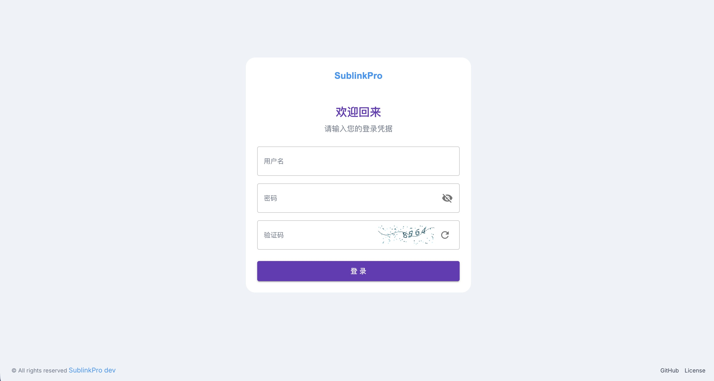 | 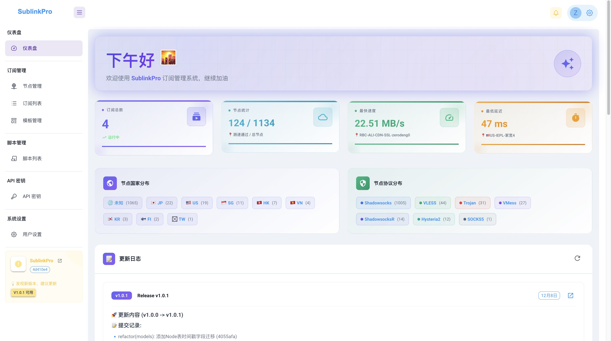 |
| 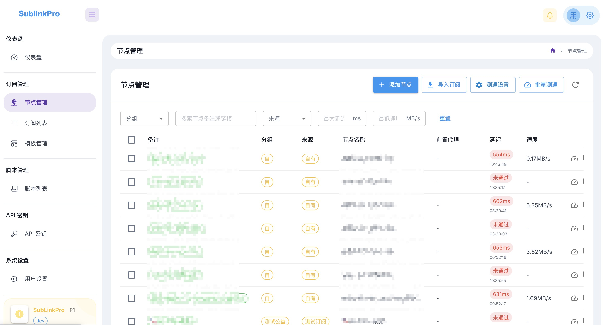 | 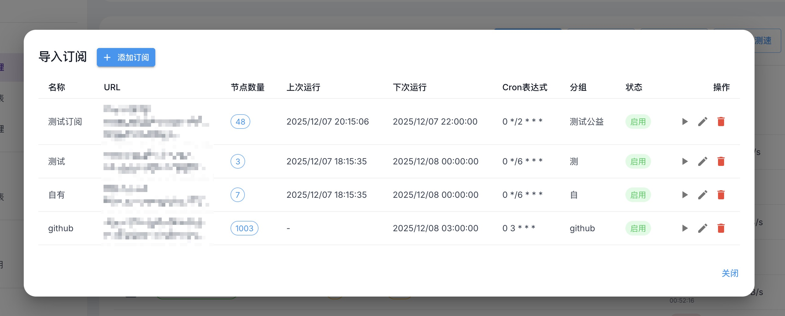 |
| 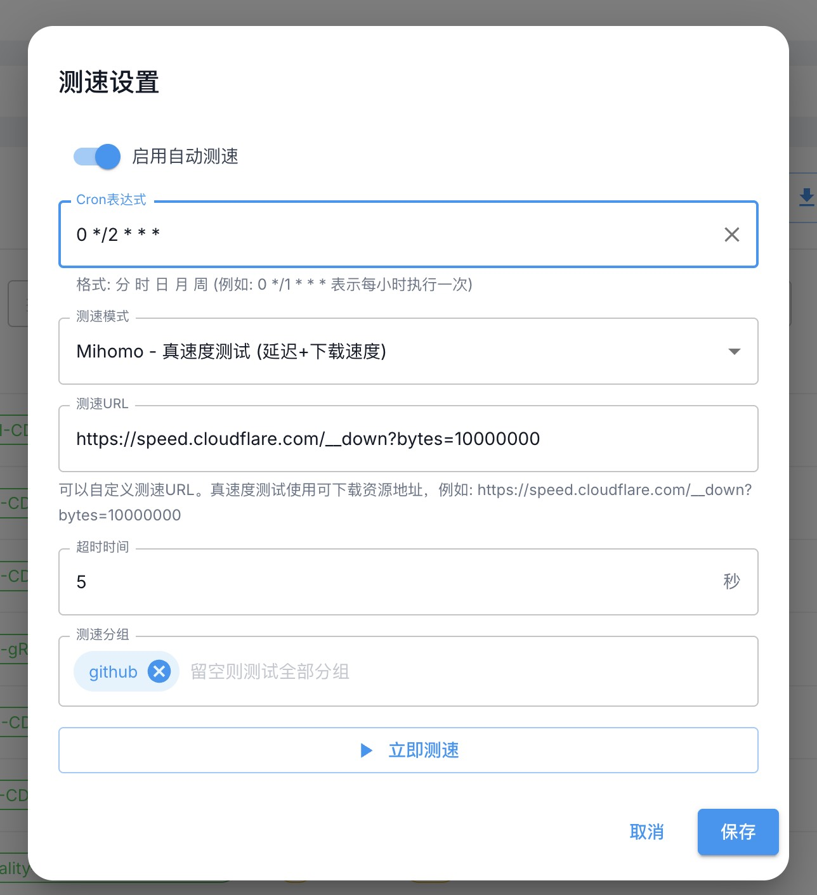 | 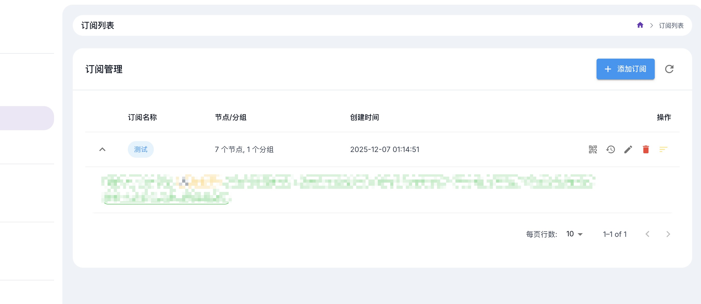 |
| 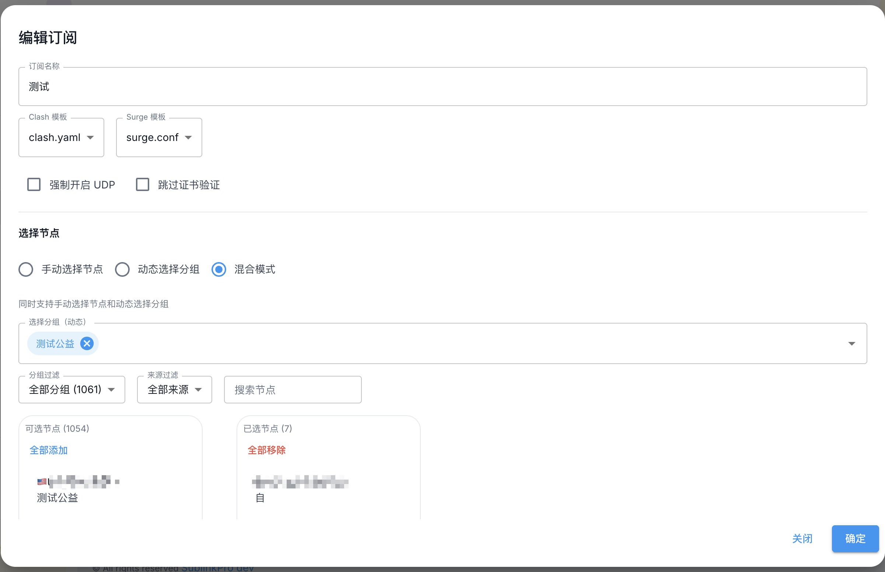 | 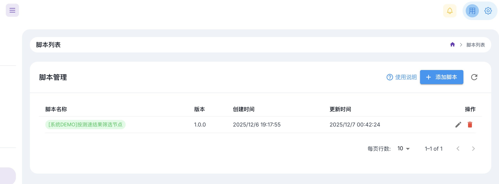 |
| 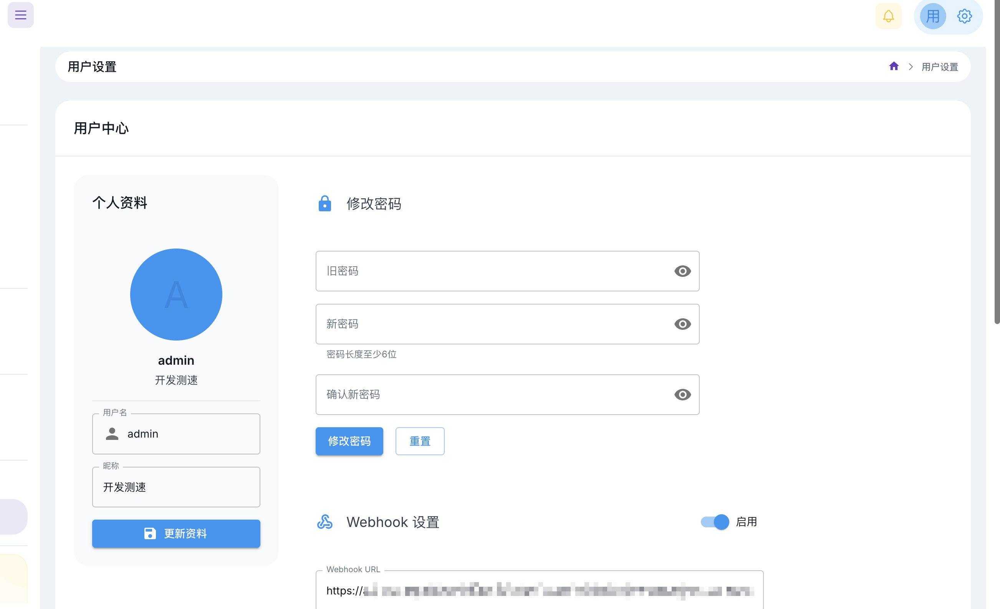 | 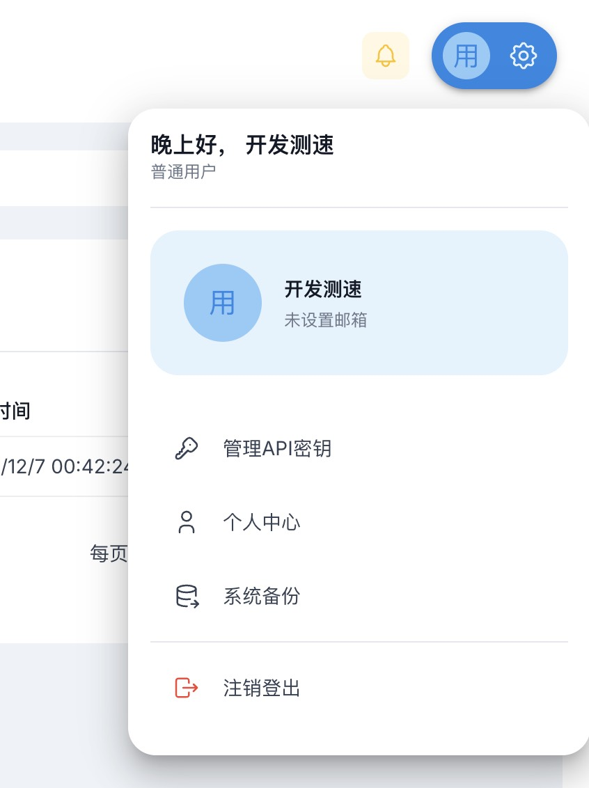 |

</details>

---

## 📜 脚本功能说明

SublinkPro 支持使用 JavaScript 脚本对订阅内容进行自定义处理。

### 1️⃣ 节点过滤 `filterNode`

在生成订阅内容之前执行，用于对节点列表进行过滤或修改。

<details>
<summary><b>查看函数签名与示例</b></summary>

**函数签名:**
```javascript
function filterNode(nodes, clientType) {
    // nodes: 节点对象数组
    // clientType: 客户端类型 (v2ray, clash, surge)
    // 返回值: 修改后的节点对象数组
    return nodes;
}
```

**示例:**
```javascript
function filterNode(nodes, clientType) {
    // 过滤掉名称包含 "测试" 的节点
    var newNodes = [];
    for (var i = 0; i < nodes.length; i++) {
        if (nodes[i].Name.indexOf("测试") === -1) {
            newNodes.push(nodes[i]);
        }
    }
    return newNodes;
}
```

</details>

### 2️⃣ 内容后处理 `subMod`

在生成最终订阅内容之后执行，用于对最终的文本内容进行修改。

<details>
<summary><b>查看函数签名与示例</b></summary>

**函数签名:**
```javascript
function subMod(input, clientType) {
    // input: 原始输入内容
    // clientType: 客户端类型
    // 返回值: 修改后的内容字符串
    return input;
}
```

</details>

> [!NOTE]
> - 脚本中可以使用 `console.log()` 输出日志到后台
> - 多个脚本会按照排序顺序依次执行
> - 脚本支持的函数请查看 [📚 脚本文档](docs/script_support.md)

---

## 🛠️ 开发指南

欢迎参与 SublinkPro 的开发！以下是项目结构和开发相关说明。

### 📁 项目结构

```
sublinkPro/
├── 📂 api/                    # API 接口层
│   ├── node.go               # 节点相关 API
│   ├── sub.go                # 订阅相关 API
│   ├── tag.go                # 标签相关 API
│   ├── template.go           # 模板相关 API
│   ├── setting.go            # 设置相关 API
│   └── ...
├── 📂 models/                 # 数据模型层
│   ├── node.go               # 节点模型
│   ├── subcription.go        # 订阅模型
│   ├── tag.go                # 标签模型
│   ├── template.go           # 模板模型
│   ├── db_migrate.go         # 数据库迁移
│   └── ...
├── 📂 services/               # 业务服务层
│   ├── scheduler.go          # 定时任务调度器
│   ├── tag_service.go        # 标签服务
│   ├── 📂 geoip/             # GeoIP 服务
│   ├── 📂 mihomo/            # Mihomo 核心服务
│   └── 📂 sse/               # Server-Sent Events
├── 📂 routers/                # 路由定义
│   ├── node.go               # 节点路由
│   ├── tag.go                # 标签路由
│   └── ...
├── 📂 node/                   # 节点协议解析
│   ├── sub.go                # 订阅链接解析
│   └── 📂 protocol/          # 各协议解析器
├── 📂 utils/                  # 工具函数
│   ├── speedtest.go          # 测速工具
│   ├── node_renamer.go       # 节点重命名工具
│   ├── script_executor.go    # 脚本执行器
│   └── ...
├── 📂 middlewares/            # 中间件
├── 📂 constants/              # 常量定义
├── 📂 database/               # 数据库连接
├── 📂 cache/                  # 缓存管理
├── 📂 dto/                    # 数据传输对象
├── 📂 webs/                   # 前端代码 (React)
│   └── 📂 src/
│       ├── 📂 api/           # API 调用
│       ├── 📂 views/         # 页面视图
│       │   ├── 📂 dashboard/ # 仪表盘
│       │   ├── 📂 nodes/     # 节点管理
│       │   ├── 📂 subscriptions/ # 订阅管理
│       │   ├── 📂 tags/      # 标签管理
│       │   ├── 📂 templates/ # 模板管理
│       │   └── 📂 settings/  # 系统设置
│       ├── 📂 components/    # 公共组件
│       ├── 📂 contexts/      # React Context
│       ├── 📂 hooks/         # 自定义 Hooks
│       ├── 📂 themes/        # 主题配置
│       └── 📂 layout/        # 布局组件
├── 📂 template/               # 订阅模板文件
├── 📂 docs/                   # 文档
├── main.go                   # 程序入口
├── go.mod                    # Go 依赖管理
├── Dockerfile                # Docker 构建文件
└── README.md                 # 项目说明
```

### 🔧 技术栈

| 层级 | 技术 |
|:---|:---|
| **后端框架** | Go + Gin |
| **ORM** | GORM |
| **数据库** | SQLite |
| **前端框架** | React 18 + Vite |
| **UI 组件库** | Material UI (MUI) |
| **状态管理** | React Context |
| **构建工具** | Vite |

### 💻 本地开发

#### 1. 克隆项目
```bash
git clone https://github.com/ZeroDeng01/sublinkPro.git
cd sublinkPro
```

#### 2. 后端开发
```bash
# 安装 Go 依赖
go mod download

# 运行后端（开发模式）
go run main.go
```

#### 3. 前端开发
```bash
# 进入前端目录
cd webs

# 安装依赖
yarn install

# 启动开发服务器
yarn dev
```

#### 4. 构建生产版本
```bash
# 构建前端
cd webs && yarn build

# 构建后端（嵌入前端资源）
go build -o sublinkpro main.go
```

### 📝 开发规范

- **代码风格**：后端遵循 Go 官方规范，前端使用 ESLint + Prettier
- **提交规范**：使用语义化提交信息（feat/fix/docs/refactor 等）
- **分支管理**：`main` 为稳定分支，`dev` 为开发分支
- **API 设计**：RESTful 风格，统一响应格式

### 🔍 关键模块说明

| 模块 | 文件 | 说明 |
|:---|:---|:---|
| 节点测速 | `services/scheduler.go` | 包含延迟测试、速度测试的核心逻辑 |
| 标签规则 | `services/tag_service.go` | 自动标签规则的执行与匹配 |
| 订阅生成 | `api/clients.go` | 订阅链接的生成与节点筛选 |
| 协议解析 | `node/protocol/*.go` | 各种代理协议的解析实现 |
| 数据迁移 | `models/db_migrate.go` | 数据库版本升级迁移脚本 |

---

## 📊 项目统计

<div align="center">

[//]: # (  )
  
  
</div>

---

## 🤝 贡献与支持

如果这个项目对您有帮助，欢迎：

- ⭐ **Star** 这个项目表示支持
- 🐛 提交 [Issue](https://github.com/ZeroDeng01/sublinkPro/issues) 反馈问题或建议
- 🔧 提交 Pull Request 贡献代码
- 📖 完善文档和使用教程

### 🙏 致谢

感谢以下项目的开源贡献：

- [sublinkX](https://github.com/gooaclok819/sublinkX) / [sublinkE](https://github.com/eun1e/sublinkE) - 原始项目
- [Berry Free React Admin Template](https://github.com/codedthemes/berry-free-react-admin-template) - 前端模板
- [Mihomo](https://github.com/MetaCubeX/mihomo) - 代理核心

---

<div align="center">
  <sub>Made with ❤️ by <a href="https://github.com/ZeroDeng01">ZeroDeng01</a></sub>
</div>

