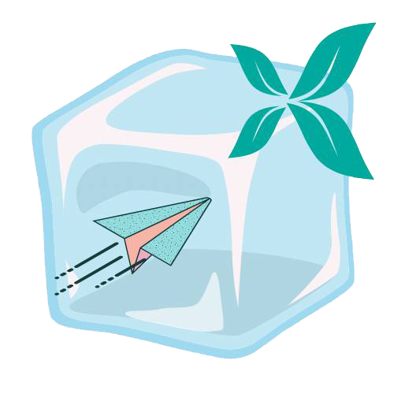
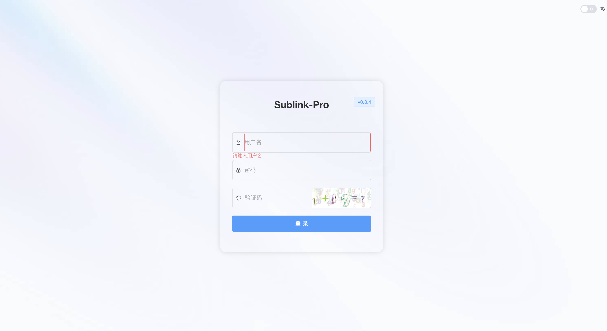
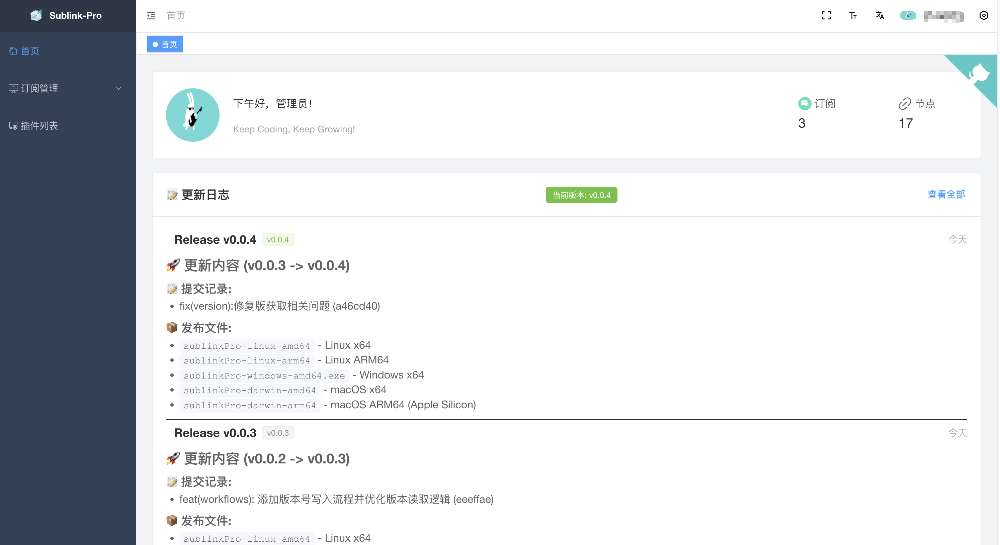
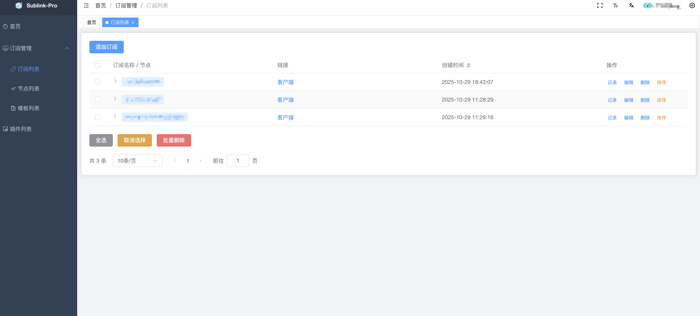
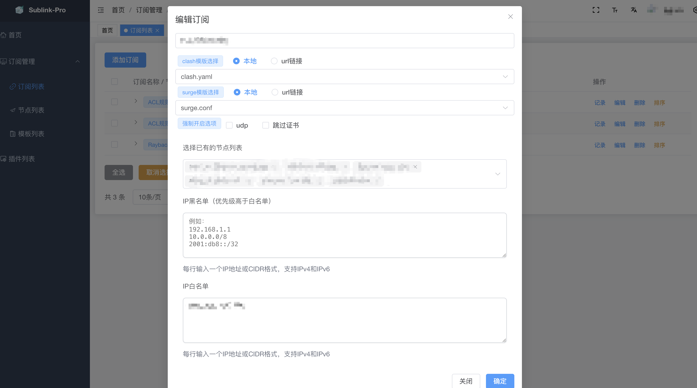
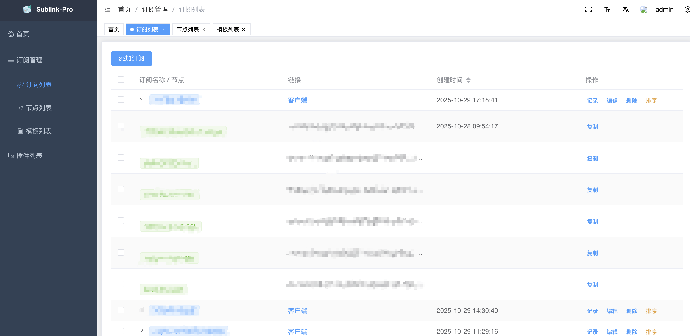
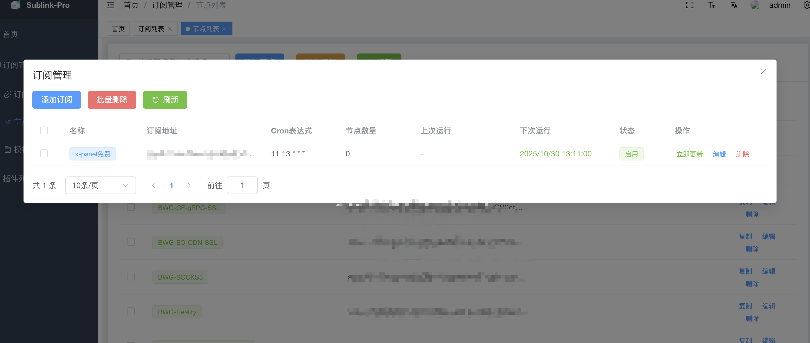

<div align="center">

</div>

<div align="center">
  
  
  
  
  <div align="center"> 中文 | <a href="README.en-US.md">English</div>


</div>

# 项目简介

`sublinkPro` 是基于优秀的开源项目  [sublinkX](https://github.com/gooaclok819/sublinkX) /[sublinkE](https://github.com/eun1e/sublinkE)  进行二次开发，仅在原项目基础上做了部分定制优化。建议用户优先参考和使用原项目，感谢原作者的付出与贡献。

- 前端基于 [vue3-element-admin](https://github.com/youlaitech/vue3-element-admin)；
- 后端采用 Go + Gin + Gorm；
- 默认账号：admin 密码：123456，请安装后务必自行修改；

# 修改内容


- [x] 修复部分页面BUG
- [x] 支持 Clash `dialer-proxy` 属性
- [x] 允许添加并使用 API KEY 访问 API
- [x] 导入、定时更新订阅链接中的节点
- [x] 支持AnyTLS、Socks5协议
- [x] 订阅节点排序
- [x] 支持订阅的IP黑/白名单功能
- [x] 支持节点测速功能
- [x] 支持按照测速结果作为条件筛选返回的节点
- [ ] ...

# 项目特色

- 高自由度与安全性，支持访问订阅记录及简易配置管理；
- 支持多种客户端协议及格式，包括：
    - v2ray（base64 通用格式）
    - clash（支持 ss, ssr, trojan, vmess, vless, hy, hy2, tuic, AnyTLS, Socks5）
    - surge（支持 ss, trojan, vmess, hy2, tuic）
- 新增 token 授权及订阅导入功能，增强安全性和便捷性。

# 安装说明

## Docker 运行
```bash
docker run --name sublinke -p 8000:8000 \
-v $PWD/db:/app/db \
-v $PWD/template:/app/template \
-v $PWD/logs:/app/logs \
-d zerodeng/sublink-pro 
```

## 一键安装
```bash
wget https://raw.githubusercontent.com/ZeroDeng01/sublinkPro/refs/heads/main/install.sh   && sh install.sh
```

> ⚠ **注意**  
> 在 **Alpine Linux** 上运行一键安装脚本时，由于 Alpine 使用 `musl` 而非 `glibc`，插件模块无法正常工作。 
> 推荐优先使用 **Docker 部署** 以获得最佳兼容性，或可选择 **Debian / Ubuntu** 等发行版。


# 项目预览







